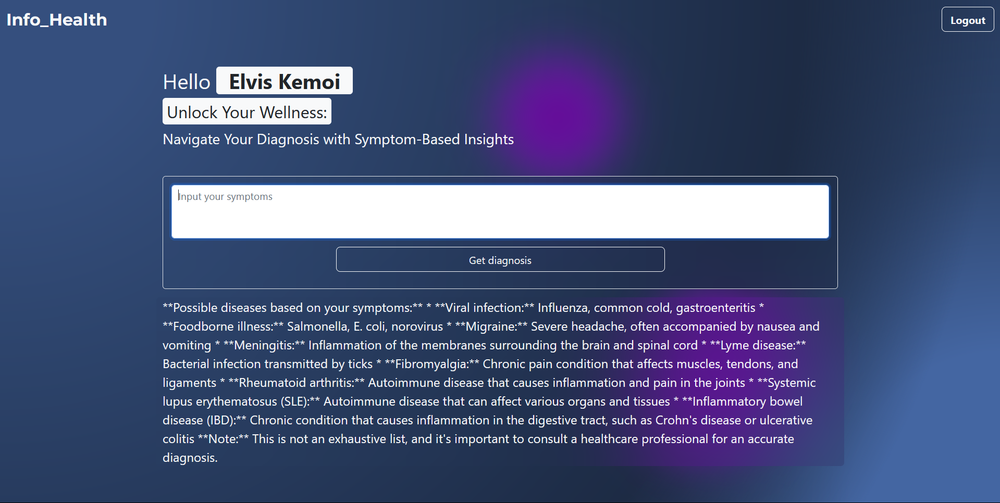

<h1>Info_Health</h1>
<h2>Navigate Your Diagnosis with Symptom-Based Insights</h2>

<h2><u>Setting Up</u></h2>
<ol type="1">
  <li>Make a dotenv file</li>
  <li>In the dotenv file, make a variable for the gemini api key as "GOOGLE_API_KEY" and the session secret as "SESSION_SECRET" then give the session secret any value. </li>
  <li>Start the server by running the server.js file with nodemon or the command <u>Npm run Start</u> </li>
</ol>
